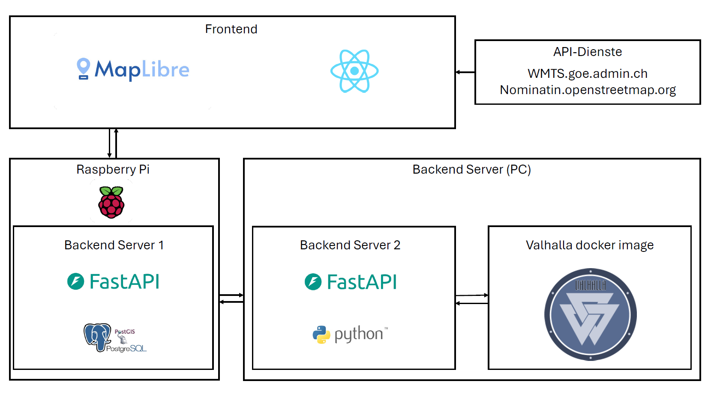

# Aufbau der Geodateninfrastruktur (GDI)

Die Geodateninfrastruktur von RecyclRoute besteht aus zwei Backends, einem Frontend sowie einem weiteren Backend-Docker-Server (Valhalla). Die folgende Darstellung zeigt die momentane Systemarchitektur von RecyclRoute:

{: style="max-width: 100%; height: auto;" }

## Backend

Das Backend umfasst sämtliche serverseitigen Prozesse und Daten. Die zugrundeliegende PostgreSQL/PostGIS-Datenbank wird über ein Python-Skript (API-Abfragen) automatisiert mit Geodaten und Routen befüllt. Das Backend interagiert dabei direkt mit der PostgreSQL/PostGIS-Datenbank um neue Informationen abzuspeichern, um bestehende Informationen abzufragen oder um bestehende Informationen zu löschen. Das Backend ist in 3 verschiedene Server unterteilt. Der Hauptserver wird auf einem RaspberryPi gehostet und umfasst alle Anfragen an die Datenbank sowie an den zweiten Server. Da der RaspberryPi nur eine geringe Rechenleistung bietet, wird ein zweiter Server auf einem Laptop gehostet, dieser umfasst den gesamten Berechnungsprozess. Da der zweite Server auf eine API-Schnitstelle vom Repository Valhalla zugreifen muss, wird ein Docker-Container mit entsprechendem Image von Valhalla ebenfalls auf einem Laptop gehostet. 

### Hauptserver Punktverwaltung

| Endpunkt                          | Funktion                                                                 | Verwendung                                                                                           |
|----------------------------------|--------------------------------------------------------------------------|------------------------------------------------------------------------------------------------------|
| GET /getPointTypes               | Gibt eine Liste von vordefinierten Punkt-Typen (z. B. „falsch deponiert“) zurück. | add_marker_popup.jsx: greift alle möglichen Punkttypen ab                                           |
| GET /getPointsByProject/{project_id} | Holt alle Punkte, die einem bestimmten Projekt zugeordnet sind. Enthält Typ, Datum, Bild (als Base64), Koordinaten. | MapLayerPopup.jsx : erstellt für jeden Punkt aus der Datenbank ein Marker mit zugehörigem Popup     |
| POST /addPointWithDetails       | Fügt einen neuen Punkt zu einem Projekt hinzu. Übergibt Punkt-Typ, Datum, Koordinaten und ein Bild (Dateiupload per FormData). | add_marker_popup.jsx: schickt einen neuen Punkt mit allen notwendigen informationen an die Datenbank um diesen dort zu speichern |
| DELETE /deletePoint/{point_id}  | Löscht einen Punkt anhand seiner ID aus der Datenbank.                   | Wurde noch nicht im Frontend Implementiert                                                           |

### Hauptserver Projektverwaltung

| Endpunkt                         | Funktion                                                                 | Verwendung                                                                                           |
|----------------------------------|--------------------------------------------------------------------------|------------------------------------------------------------------------------------------------------|
| POST /addProject                 | Fügt ein neues Projekt hinzu mit Name, Gemeinde, Datum und Perimeter (Polygon). Berechnet Fläche und speichert GeoJSON. | plannerpage.jsx und MapSwissimage.jsx : Sendet ein neues Projekt mit zugehöriger Geometrie in die Datenbank, um diese zu speichern. |
| GET /getProjects                 | Holt alle Projekte aus der Datenbank, inklusive Geometrie (als GeoJSON) und Metadaten. | plannerpage.jsx, add_marker_popup.jsx, ProjectManagerButton.jsxund MapLayerPopup.jsx: schreibt alle verfügbaren Projekte in eine Statevariabel |
| DELETE /deleteProject/{project_id} | Löscht ein Projekt anhand der ID. Alle zugehörigen Punkte werden durch ON DELETE CASCADE mitgelöscht. | ProjectDeleteCallbackPopup.jsx: Löscht das ausgewählte projekt und alle abhängigkeiten in der DB     |

### Hauptserver Berechnungen

| Endpunkt                         | Funktion                                                                 | Verwendung                                                                                           |
|----------------------------------|--------------------------------------------------------------------------|------------------------------------------------------------------------------------------------------|
| POST /berechnen                  | Sendet Projekt-Perimeter und eine Punktgeometrie an einen zweiten Dienst (localhost:7999/calculate) zur Berechnung/Analyse. | plannerpage.jsx : sendet das aktive Projekt mitsamt einem startpunkt um die Berechnung zu starten   |
| POST /notifyCalculationDone     | Wird vom externen Dienst aufgerufen, sobald eine Berechnung abgeschlossen ist. Aktualisiert den internen Status. | Main2.py (Berechnungsserver) : Der zweite Server schickt eine Nachricht an den ersten Server damit dieser weiss die Berechnung ist fertig. |
| GET /getCalculationStatus       | Gibt zurück, ob die Berechnung für ein bestimmtes Projekt abgeschlossen ist (pending oder done). | CalculateWaitingPopUp.jsx : fragt periodisch ab ob die Berechnung beendet ist.                      |

### Berechnungsserver: Berechnungen

| Endpunkt                         | Funktion                                                                 | Verwendung                                                                                           |
|----------------------------------|--------------------------------------------------------------------------|------------------------------------------------------------------------------------------------------|
| POST /calculate                  | Führt eine Routing-Berechnung durch, basierend auf einem Polygon (Projekt-Perimeter) und einem Startpunkt. | Main.py (Hauptserver) : Schickt eine anfrage mit Polygon und Startpunkt sowie Projekt ID an den Berechnungsserver, um die Berechnung zu starten. |
| GET /test                        | Führt eine Test-Routing-Berechnung mit statischen, vordefinierten Daten aus. | Wird lediglich für Debugging und Testzwecke verwendet.                                               |

# Grundlagedaten

| **Name**          | **Herkunft**                          | **Verwendung**                          |
|--------------------|---------------------------------------|-----------------------------------------|
| **swissTLM3D**     | Bundesamt für Landestopografie (swisstopo) | Bereitstellung der Strassengeometrie (Linien, Knoten, Topologie) für Routing und Kartenvisualisierung. |
| **SwissImage**     | Bundesamt für Landestopografie (swisstopo) | Hochaufgelöster Bildhintergrund (Orthofoto) für die Kartenbasis. |
| **Nominatim** (OpenStreetMap) | OpenStreetMap-Community (nominatim.openstreetmap.org) | Suchfunktion (Geocoding) zur Adress- und Ortsnamenssuche. |

---

## Datenquellen-Details

### swissTLM3D
- **Format**: Vektordaten (3D)
- **Bezug**: [swisstopo](https://www.swisstopo.admin.ch/de/landschaftsmodell-swisstlm3d)  
- **Nutzung**: Strassennetz für Routing, Höhendaten für Geländedarstellung.

### SwissImage
- **Format**: Rasterdaten
- **Auflösung**: 10 cm (HD), 25 cm (Standard)  
- **Spektral**: RGB/Infrarot  
- **Bezug**: [swisstopo](https://www.swisstopo.admin.ch/de/orthobilder-swissimage-10-cm)  
- **Nutzung**: Realistische Kartenhintergründe.

### Nominatim (OSM)
- **API**: OpenStreetMap-basierter Geocoding-Dienst  
- **Funktion**: Umwandlung von Adressen in Koordinaten (und umgekehrt)  
- **Nutzung**: Suchfunktion im Frontend.  
- **Hinweis**: Nutzungsbedingungen beachten (z.B. Attribution).  

## Datenbank

Die Datenbank wurde in PostgreSQL/PostGIS aufgebaut. Sie enthält u. a. folgende Tabellen:
- `project` (ID, Name, Datum, Gemeindename, Geometrie (Polygon))
- `points` (ID, ProjektID, Typ, Datum, Foto, Geometrie (Punkt))

Die folgenden Tabellen wurden nicht wie im geplanten Logischen Datenmodell erstellt:
- `material`: die Tabelle Material wurde noch nicht eingebunden da diese Tabelle nicht zwingend nötig ist und im "minimal working product" noch nicht benötigt wird.
- `hintergrund`: die Tabelle Hintergrund wurde nicht eingebunden da auf die Funktionalität den Hintergrund zu ändern verzichtet wurde und dies sowieso Frontend-technisch gelöst werden würde. Es wird auf die Funktion verzichtet, damit die gesamte Anwendung einfacher zu benutzen ist.
- `user` : Die Tabelle User wurde nicht eingebunden da auf die gesamte User-Identifikation aus komplexitätsgründen verzichtet wurde..
- `role` : Die Tabelle Role wurde nicht eingebunden da sie abhängig von der Tabelle User ist und somit nicht benötigt wird. 
- `chinese_postman_polygon` : Die Tabelle Chinese_Postman_Polygon wurde noch nicht eingebunden da diese Funktionalität der Routenberechnung im Backend noch nicht vollständig Funktionstüchtig ist. 
- `route` : Die Tabelle Route wurde nicht eingebunden da sie abhängig von der Tabelle Chinese_Postman_Polygon ist und somit nicht benötigt wird. 
- `kanten` : Die Tabelle Kanten wurde nicht eingebunden da sie abhängig von der Tabelle Chinese_Postman_Polygon ist und somit nicht benötigt wird. 

Die Daten werden via den Hauptserver im Backend abgefragt und im Frontend genutzt oder vom Frontend über den Hauptserver in die Datenbank geschrieben.

## Frontend

Das Frontend von RecyclRoute ist eine interaktive Webanwendung, die auf [React](https://react.dev/) und [MapLibre](https://maplibre.org/) basiert. Es besteht aus mehreren Komponenten:

### React

[React](https://react.dev/) dient dem Aufbau der Benutzeroberfläche. Es wird verwendet, um interaktive Elemente wie die Kartenansicht, Navigation, Suchfunktionen, Eingabeboxen und Infoboxen umzusetzen. Der Zustand der Anwendung (z. B. „neues Projekt erstellen“) wird komponentenbasiert verwaltet und mit Popup-Fenstern angesteuert.

### npm

Der [Node Package Manager (npm)](https://www.npmjs.com/) wird verwendet, um alle benötigten Bibliotheken und Abhängigkeiten (z.B. MapLibre, React, etc.) zu verwalten und das Frontend zu bauen.

### MapLibre

[MapLibre](https://maplibre.org/) ist für die Darstellung und Interaktion mit der Karte zuständig. Layer aus der Datenbank werden via API (WMS/WFS) eingebunden, Routen dargestellt, Polygone und Punkte erfasst und Benutzerinteraktionen ermöglicht. Die Abfrage von Features (z. B. aktiviertes Projekt / Layer darstellen) erfolgt dynamisch.

## Aufbau Frontend
{: style="max-width: 75%; height: auto;" }

### UI Design

Das Design von RecyclRoute ist bewusst **minimalistisch und funktional** gehalten. Die Farben Grün, Beige und Dunkelbraun spiegeln das Thema Nachhaltigkeit und Orientierung wider. Buttons und Kartenlayer sind einheitlich gestaltet und reagieren auf Mausbewegungen durch Hover- und Fokuszustände. Die Plannerpage und die Reportpage wurden bewusst farblich getrennt, um dem User bewusst zu machen, dass dies zwei unterschiedliche Funktionen für unterschiedliche Anwender sind.

Alle UI-Komponenten, wie auch Dropdowns und andere interaktive Felder wurden manuell mit [HTML](https://developer.mozilla.org/de/docs/Web/HTML) und [CSS](https://developer.mozilla.org/de/docs/Web/CSS) gestaltet. Es wurde bewusst auf die Verwendung von Material UI verzichtet, um so die gewünschten Visualisierungen besser umsezten zu können und die Komponenten von Null auf aufgebaut werden konnten.

### UX Design

Im Zentrum der **User Experience (UX)** steht eine **intuitive Nutzerführung**: Points of Interest (POI) oder Projekte sowie die dazugehörige Navigation lassen sich einfach erkunden, bearbeiten und aktualisieren. Die Anwendung wurde mit dem durchspielen eines gewöhnlichen Userpfades auf eine einfache Bedienbarkeit überprüft und optimiert.

Das gesamte Frontend wurde so programmiert, dass die meisten Aktionen in möglichst wenigen Klicks und mit einem geleiteten Pfad angewendet werden können, um entweder einen POI abzusetzen oder ein neues Projekt zu erstellen bis hin zur Routennavigaiton.

---

[↑ Zurück zum Beginn der Webseite](#top) 

  

    <a href="funktionen_report.html">← Funktionen Report</a>
  

  

    <a href="installation.html">Installation →</a>
  

