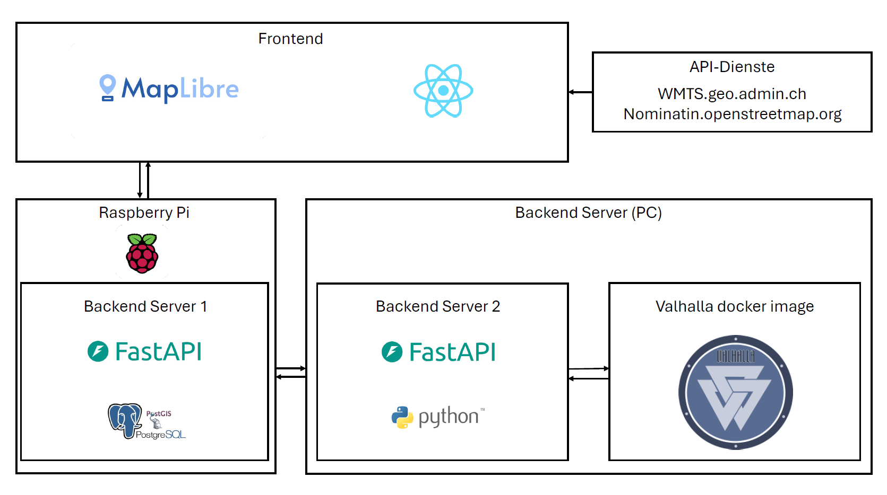

# Aufbau der Geodateninfrastruktur (GDI)

Die Geodateninfrastruktur von RecyclRoute besteht aus zwei Backends, einem Frontend sowie einem weiteren backend Docker server (valhalla). Die folgende Darstellung zeigt die momentane Systemarchitektur von RecyclRoute:

{: style="max-width: 100%; height: auto;" }

## Backend

Das Backend umfasst sämtliche Serverseitigen Prozesse und Daten. Die zugrundeliegende PostgreSQL/PostGIS-Datenbank wird über ein Python-Skript automatisiert mit Geo- und Routendaten befüllt. Das Backend interagiert dabei direkt mit der PostgreSQL/PostGIS-Datenbank um neue Informationen abzuspeichern, um bestehende Informationen abzufragen oder um bestehende Informationen zu löschen. Das Backend is in 3 verschiedene Server unterteilt. Der Hauptserver wird auf einem RaspberryPi gehostet und umfasst alle Anfragen an die Datenbank sowie an den zweiten Server. Da der RaspberryPi nicht viel Rechenleistung bietet, wird ein zweiter Server auf einem Laptop gehostet, dieser umfasst den gesamten Berechnungsprozess. Da der zweite Server auf eine API-Schnitstelle von dem Repository Valhalla zugreifen muss wird ein Docker Container mit entsprechendem Image von Valhalla ebenfalls auf einem Laptop gehostet. 

### Grundlagedaten

Die Grundlagedaten bestehen aus dem  **Straßennetzen**  ergänzt durch eigens berechnete Routen. Die Strassendaten stammen aus der [swissTLM3D](https://www.swisstopo.admin.ch/de/geodata/landscape/tlm3d.html), die Routen werden durch ein angepasstes Python-Routing-Skript (basierend auf dem Chinese Postman Problem) generiert. Die Ergebnisse werden in GeoJSONs gespeichert.

Die Datenstruktur ist so aufgebaut, dass neue Regionen, Fraktionen oder Sammelarten (z. B. Glas, PET) leicht integriert werden können. Die Skripte zur Datenverarbeitung befinden sich im Repository unter `preprocessing/`.

## Datenbank

Die Datenbank wurde in PostgreSQL/PostGIS aufgebaut. Sie enthält u. a. folgende Tabellen:
- `project` (ID, Name, Datum, Gemeindename, Geometrie (Polygon))
- `points` (ID, ProjektID, Typ, Datum, Foto, Geometrie (Punkt))

Die folgenden Tabellen wurden nicht wie im geplanten Logischen Datenmodell erstellt:
- `material`: die Tabelle Material wurde noch nicht eingebunden da diese Tabelle nicht unabdinglcih ist und in der minimal working product nicht benötigt wird.
- `hintergrund`: die Tabelle Hintergrund wurde nicht eingebunden da auf die Funktionalität den Hintergrund zu ändern verzichtet wurde. Dies wurde so entschieden damit die gesamte Anwendung einfacher zu benutzen ist.
- `user` : Die Tabelle User wurde nicht eingebunden da auf die gesamte User Identifikation aus komplexitätsgründen verzichtet wurde. Dies wurde ebenfalls an während einer Besprechung entschieden.
- `role` : Die Tabelle Role wurde nicht eingebunden da sie abhängig von der Tabelle User ist und somit nicht benötigt wird. 
- `chinese_postman_polygon` : Die Tabelle Chinese_Postman_Polygon wurde nicht eingebunden da diese Funktionalität der Routenberechnung im Backend noch nicht vollständig Funktionstüchtig ist. 
- `route` : Die Tabelle Route wurde nicht eingebunden da sie abhängig von der Tabelle Chinese_Postman_Polygon ist und somit nicht benötigt wird. 
- `kanten` : Die Tabelle Kanten wurde nicht eingebunden da sie abhängig von der Tabelle Chinese_Postman_Polygon ist und somit nicht benötigt wird. 

Die Daten werden via den Hauptserver im Backend abgefragt und im Frontend genutzt oder vom Frontend über den Hauptserver in die Datenbank geschrieben.

## Frontend

Das Frontend von RecyclRoute ist eine interaktive Webanwendung, die auf [React](https://react.dev/), [OpenLayers](https://openlayers.org/) und [Axios](https://axios-http.com/docs/intro) basiert. Es besteht aus mehreren Komponenten:

### React

[React](https://react.dev/) dient dem Aufbau der Benutzeroberfläche. Es wird verwendet, um interaktive Elemente wie die Kartenansicht, Navigation, Filterfunktionen und Infoboxen umzusetzen. Der Zustand der Anwendung (z. B. „aktueller Streckenabschnitt“) wird komponentenbasiert verwaltet.

### npm

Der [Node Package Manager (npm)](https://www.npmjs.com/) wird verwendet, um alle benötigten Bibliotheken und Abhängigkeiten (z. B. OpenLayers, Axios, Zustand) zu verwalten und das Frontend zu bauen.

### MapLibre

[OpenLayers](https://openlayers.org/) ist für die Darstellung und Interaktion mit der Karte zuständig. Layer aus dem GeoServer (WMS/WFS) werden eingebunden, Streckenabschnitte hervorgehoben und Benutzerinteraktionen ermöglicht. Die Abfrage von Features (z. B. aktuell bearbeiteter Routenabschnitt) erfolgt dynamisch via `getSource().getFeatures()`.

### UI Design

Das Design von RecyclRoute ist bewusst **minimalistisch und funktional** gehalten. Die Farben Grün, Beige und Dunkelbraun spiegeln das Thema Nachhaltigkeit und Orientierung wider. Buttons und Kartenlayer sind einheitlich gestaltet und reagieren auf Mausbewegungen durch Hover- und Fokuszustände.

Alle UI-Komponenten wurden manuell mit [HTML](https://developer.mozilla.org/de/docs/Web/HTML) und [CSS](https://developer.mozilla.org/de/docs/Web/CSS) gestaltet. Dropdowns und interaktive Felder wurden mit [Material UI](https://mui.com/) realisiert.

### UX Design

Im Zentrum steht eine **intuitive Nutzerführung**: Sammelstellen, Routen und Status lassen sich einfach erkunden, bearbeiten und aktualisieren. Die Anwendung wurde im Rahmen eines UX-Tests mit 6 Testpersonen auf Bedienbarkeit überprüft. Feedback floss in die Gestaltung der Navigationsstruktur, Buttonplatzierung und Interaktionsrückmeldungen ein.

Die meisten Aktionen erfordern **maximal zwei Klicks**, um von einer Sammelstelle zur vollständigen Route zu navigieren oder den Bearbeitungsstatus einer Straße zu aktualisieren.

---

[↑ Zurück zum Beginn der Webseite](#top) 

  

    <a href="funktionen.html">← Erklärung der Funktionen</a>
  

  

    <a href="konzept.html">Konzept und Ideen →</a>
  

