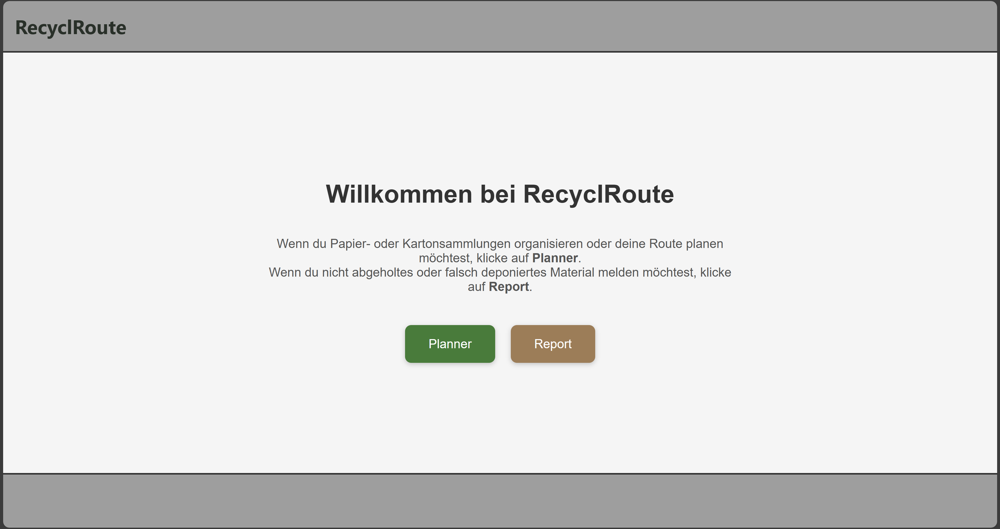

# Erklärung der Funktionen von RecyclRoute

In diesem Abschnitt werden die Funktionen und Interaktionen der RecyclRoute beschrieben.

# Startpage

Auf der Startseite muss man sich bereits ein erstesmal entscheiden was man machen möchte. Wenn man Papier- oder Kartonsammlungen organisieren oder deine Route planen möchtest, muss man auf Planner klicken. Wenn du nicht abgeholtes oder falsch deponiertes Material melden möchtest, muss man auf Report klicken. Dann wird man dementsprechend auf die Seite mit den Entsprechenden Seiten geleitet. Die Farbe soll dabei auch gleich aufzeigen wo man ist. So ist der Planner in Grüntönen gehalten wärend der Report in Braun gehalten ist. Beides so, dass es doch auch das man es mit Recycling, Umwelt und Ökologischen Themen direkt assoziert.

## Funktionen Planer:

### Projekt erstellen

#### Berechnungsalgorithmus

**Routing- und Optimierungs-Tool für vollständige Wegenetzbefahrung**

**Zweck**

Das ganze ist in einem Python-Skript aufgebaut und soll automatisiert eine optimale Route durch ein definiertes Strassennetz berechnen. Ziel ist es, alle relevanten Strassen in einem Gebiet möglichst effizient und ohne doppelte Befahrung abzufahren – ähnlich zum sogenannten Chinese Postman Problem welches eher Bekannt ist.

**Eingaben**

Als Eingaben von der App zum das Skript auszuführen folgende Daten benötigt:

- Ein JSON welches das Polygon definiert
- Ein Geopackage Datei welche mit einem Weiteren Skript vorbereitet werden muss (Preprocessing) und enthält die Geometrien und Eigenschaften der Strassenachsen
- Die Startkoordinaten welche den Ausgangspunkt der Route dienen

**Ausgaben**

Als Ausgabe werden mehrere Dateien welche verwendet werden können / in Zukunft verwendet werden könnten.
- eine Datei mit der gesamten berechneten Route als GeoJSON
- Eine Datei mit Navigationsanweisungen

**Verwendete Module**

Das Skript verwendet unter anderem folgende Python-Bibliotheken:

- Für Geodatenverarbeitung: geopandas, shapely, pyproj, networkx

- Für numerische und graphentheoretische Operationen: numpy, scipy.spatial.cKDTree

- Für Optimierung: ortools (Google OR-Tools)

- Für Routing-Anfragen: requests in Verbindung mit einer lokalen Valhalla-Instanz

- Für allgemeine Dateiverarbeitung: json, os

**Ablauf und Mathematische Grundlagen**

Zunächst werden die Startkoordinaten vom Koordinatensystem EPSG:3857 (verwendet aufgrund der von **Open Layers**) in das Schweizer Landeskoordinatensystem EPSG:2056 transformiert. Anschliessend wird das Strassennetz im Zielgebiet aufbereitet.

Die Aufbereitung erfolgt durch Einlesen des GeoPackage-Layers und Filtern irrelevanter bzw. unzulässiger Strassen. Dabei werden folgende Eigenschaften ausgeschlossen:

Objektarten wie: Ausfahrt, Einfahrt, Autobahn, Raststätte, Zufahrt, Dienstzufahrt, Autozug, Fähre, Autostrasse, Klettersteig, Provisorium

- Wanderwegtypen wie: Wanderweg, Bergwanderweg, Alpinwanderweg sowie andere

- Verkehrsbeschränkungen wie: Allgemeines Fahrverbot, Fussweg, Fussgängerzone, Gebührenpflichtig, Gesicherte Kletterpartie, Militärstrasse, Radweg, Radweg und Fussweg, Reitweg, Reitweg und Fussweg, Rennstrecke, Panzerpiste, Teststrecke, Allgemeine Verkehrsbeschränkung, Gesperrt

- Belagsarten wie: Natur

Danach werden die Liniengeometrien der verbleibenden Strassen analysiert. Einzelne Punkte entlang der Linien werden mittels Punkt-Snapping zusammengeführt, falls sie sich innerhalb einer bestimmten Toleranz (0.5 Meter) befinden. Gerade Strassenabschnitte, die einen Winkel von mehr als 170 Grad zwischen den Segmenten aufweisen, werden automatisch zusammengeführt.

Aus diesen Segmenten wird ein ungerichteter Multigraph erzeugt, in dem die Punkte als Knoten und die Strassenabschnitte als Kanten dargestellt sind. Danach werden zu kleine oder isolierte Komponenten (weniger als drei Knoten) entfernt.

Mit diesem Graphen wird danach das Chinese Postman Problem gelöst. Dazu werden alle Knoten mit ungeradem Knotengrad identifiziert. Diese Knoten werden paarweise so verbunden, dass die zusätzlichen Verbindungen eine minimale Gesamtlänge haben. Diese Minimierung erfolgt durch eine Paarung via gewichteter Matching-Optimierung. Der resultierende Graph enthält ausschliesslich gerade Knotengrade und ist daher eulerisierbar – ein Eulerkreis kann gefunden werden, der alle Kanten exakt einmal durchläuft. Der Pfad wird mit dem Hierholzer-Algorithmus berechnet, beginnend beim der Startposition am nächstgelegenen Knoten.

Optional kann die erzeugte Koordinatenfolge noch gefiltert werden, um Punkte mit zu geringem Abstand (z. B. unter 10 Metern) zu entfernen. Dieser Schritt ist jedoch standardmässig deaktiviert.

Für die weitere Optimierung wird eine Distanzmatrix aufgebaut, welche die realen Wegstrecken zwischen allen Koordinaten enthält. Diese Distanzen werden nicht als Luftlinie, sondern über Valhalla als echte Reisewege berechnet. Dabei erkennt das Skript automatisch, ob Auto- oder Fuss-Routing verwendet werden muss, da dies nicht zwingend Identisch sein muss wie die Daten welche aus dem gpkg SwissTLM3D bezogen wurden. Die Matrixberechnung erfolgt parallelisiert mit mehreren Threads.

Mit dieser Distanzmatrix wird auf eine Art das Traveling Salesman Problem (TSP) gelöst – also die Reihenfolge bestimmt, in der die Punkte mit geringster Gesamtreiselänge besucht werden. Dies geschieht mithilfe der Google OR-Tools mit der Strategie „Pfad mit geringstem Startbogen“.

Im letzten Schritt werden die optimierten Koordinaten in Teilblöcke unterteilt und jeweils bei Valhalla (selber gehostet) angefragt, um echte turn-by-turn-Navigationen zu erhalten. Pro Block werden JSON- und GeoJSON-Dateien erzeugt. Diese werden zu einer Gesamtroute zusammengefügt und als finale GeoJSON-Datei gespeichert. Parallel dazu werden detaillierte Navigationsanweisungen in ausgegeben.

## Funktionen Report:

## Funktionen allgemein:
- X
- Y
- Z

- Möglichkeit das GNSS des Gerätes zur Standortlokalisation zu nutzen

[↑ Zurück zum Beginn der Webseite](#top) 

  

    <a href="einleitung.html">← Einleitung</a>
  

  

    <a href="aufbauGDI.html">Aufbau GDI →</a>
  

