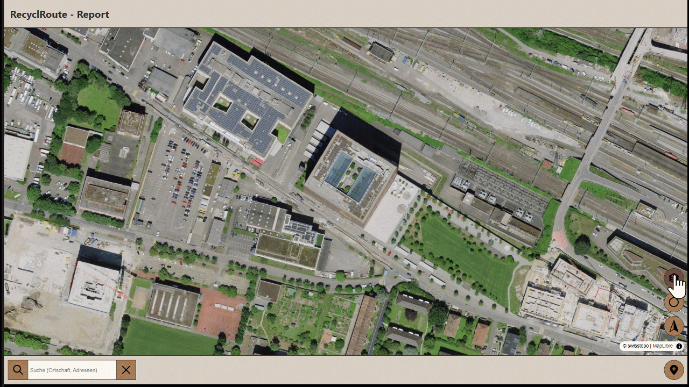
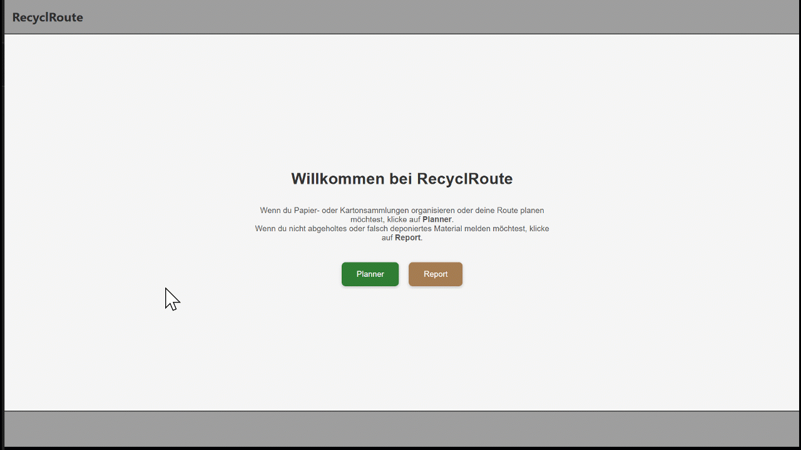
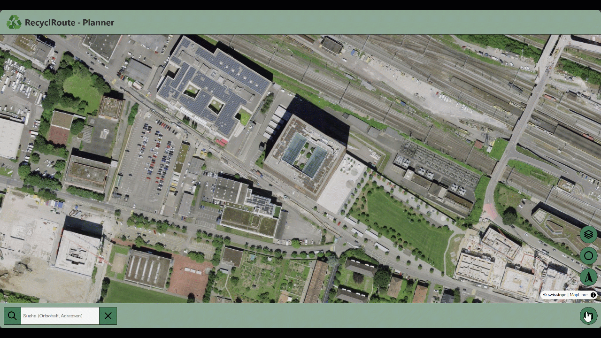
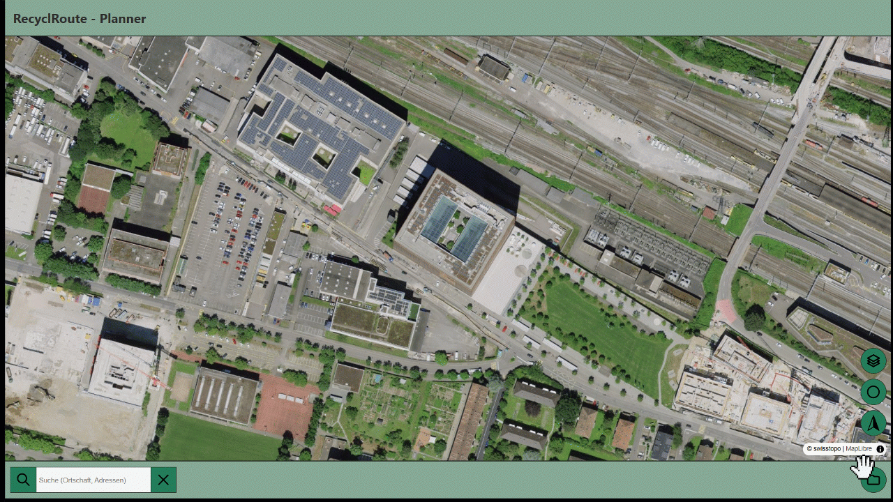

# Erklärung der Funktionen von RecyclRoute

In diesem Abschnitt werden die Funktionen und Interaktionen der RecyclRoute-Planner beschrieben.

# Startpage

Auf der Startseite muss man sich bereits ein erstesmal entscheiden was man machen möchte. Wenn man Papier- oder Kartonsammlungen organisieren oder deine Route planen möchtest, muss man auf Planner klicken. Wenn du nicht abgeholtes oder falsch deponiertes Material melden möchtest, muss man auf Report klicken. Dann wird man dementsprechend auf die Seite mit den Entsprechenden Seiten geleitet. 

{: style="max-width: 75%; height: auto;" }

# Funktionen allgemein:

Folgende vier Funktionen sind sowohl im Report als auch im Planner enthalten:

## Ort Suche
Damit kann ein spezifischer Ort gesucht und abgerufen werden.

{: style="max-width: 75%; height: auto;" }

## Reportpunkte des Projektes anzeigen
Damit kann ein Projekt ausgewählt werden und alle dem Projekt zugeordneten Projektpunkte angezeigt werden.

{: style="max-width: 75%; height: auto;" }

## Aktueller Standort anzeigen
Mit der Funktion wird die GNss Position des Gerätes abgegriffen, wenn eingeschalten & die Karte Zoom auf diesen Standort und zeigt die Position als Blauen Marker. 

{: style="max-width: 75%; height: auto;" }

## Karte nach Norden ausrichten
Mit dieser Funktion kann die Karte wieder nach Norden ausgerichtet werden wenn die Karte verdreht ist. 

{: style="max-width: 75%; height: auto;" }

# Funktionen Planner:

Nach dem Klicken auf Planner wird man auf die Planner Seite (grüntöne) weitergeleitet. Auf welcher die Standartfunktionen GNss, Norden der Karte, Anzeigen der Punkte des Projektes sowie das Planen der Route sowie das Managen der Projekte implementiert ist.

{: style="max-width: 75%; height: auto;" }

## Projektmanager
Um den Projektmanager abzurufen, kann auf den Button unten rechts geklickt werden. Sobald dieser gestartet ist sieht man alle Projekte welche in der DB gespeichert sind. Durch klicken auf ein bestimmtes Projekt kommt ein weiteres Popup, welches vier Buttons aufweist und als Titel die Projektbezeichnung enthält.

- Route berechnen; damit kann die Route des Projektes neugerechnet werden
- Routing starten; damit kann man wenn ein Routing vorhanden ist dieses starten
- Statistiken; damit können Statistiken abgerufen werden
- Projekt löschen; damit kann das Projekt aus der DB gelöscht werden.

Mit dem kleinen x kann man den Projektmanager wieder schliessen.
#ToDo
{: style="max-width: 75%; height: auto;" }

### Neues Projekt erstellen
Im Projektmanager ganz unten gibt es den Button **Neues Projekt erstellen**. Damit kann ein neues Projekt erstellt werden. Es erscheint ein neues Popup, in welchem man den Projektnamen, die Gemeinde, sowie ein Sammeldatum auswählen kann.

{: style="max-width: 75%; height: auto;" }

### Polygon definieren & Startpunkt setzen
Mit klick auf **Weiter** bestätigt man die Eingaben und man kommt auf die Karte wo man ein Polygon definieren muss welches das ganze Gebiet exakt umschliesst. Mit Doppelklick oder klick auf den Button **Perimeter speichern** bestätigt man die Eingabe. Danach muss man noch der Startpunkt der Routensammlung definieren durch klicken auf einen Standort innerhalb des gewählten Polygons.

{: style="max-width: 75%; height: auto;" }

Anschliessend kommt eine Meldung, dass die Berechnung der Route im Hintergrund passiert und man sobald die Route berechnet wurde weiter geleitet zur Navigation wird. 

### Berechnungsalgorithmus

Nachfolgend ist der ganze Berechnungsalgorithmus erklärt, wie er aufgebaut ist. Zuerst werden grundlegende Punkte erklärt und anschliessend der Ablauf und die theoretischen Grundlagen dahinter versucht zuerläutern.

{: style="max-width: 75%; height: auto;" }

# **Routing- und Optimierungs-Tool für vollständige Wegenetzbefahrung**

Das Tool ist in einem Python-Skript aufgebaut und berechnet automatisiert eine optimale Route durch ein definiertes Strassennetz. Ziel ist es, alle relevanten Strassen in einem Gebiet möglichst effizient und ohne doppelte Befahrung abzufahren – ähnlich wie das sogenannte [Chinese Postman Problem](https://en.wikipedia.org/wiki/Route_inspection_problem).

---

## Eingaben

Für die Ausführung des Skripts werden folgende Daten benötigt:

- **Ein JSON**, das das Polygon des Zielgebiets definiert (EPSG:4326)
- **Eine GeoPackage-Datei**, die mit einem weiteren Skript (Preprocessing) vorbereitet wird und die Geometrien sowie Eigenschaften der Strassenachsen enthält (z.B. SwissTLM3D)
- **Die Startkoordinaten**, die den Ausgangspunkt der Route festlegen (EPSG:3857, z.B. aus einer Webkarte)

---

## Ausgaben

Das Skript erzeugt verschiedene Dateien, die direkt verwendet werden können oder für zukünftige Anwendungen vorgesehen sind:

- **route_full.geojson**: Die gesamte berechnete Route als GeoJSON
- **navigation.geojson**: Eine Datei mit Navigationsanweisungen (turn-by-turn)
- **trace_route.json**: Rohdaten der Valhalla-Routenantwort
- **Temporäre Dateien**: Für Debugging und Weiterverarbeitung

---

## Verwendete Module

| Kategorie         | Bibliotheken/Technologien          | Verwendungszweck                     |
|-------------------|------------------------------------|---------------------------------------|
| Geodaten          | geopandas, shapely, pyproj         | Geometrieoperationen, Koordinatentransformation |
| Graphentheorie    | networkx, scipy.spatial.cKDTree    | Netzwerkaufbau, Knotenanalyse         |
| Optimierung       | ortools (Google OR-Tools)          | TSP-Lösung, Matching-Algorithmen      |
| Routing           | requests, Valhalla (lokal)         | Routing-Anfragen                      |
| Allgemein         | numpy, json, os                    | Datenverarbeitung, Dateioperationen   |

---

## Ablauf und Theoretische Grundlagen

1. **Datenvorbereitung und Koordinatentransformation**  
   Die Startkoordinaten werden von EPSG:3857 (Standard von MapLibre) ins Schweizer Landeskoordinatensystem EPSG:2056 transformiert ([translate_start_coord(coord_3857)](#translate_start_coordcoord_3857)). Das Strassennetz im Zielgebiet wird aufbereitet, indem der GeoPackage-Layer eingelesen und irrelevante Strassen gefiltert werden ([filter_street_data(gdf)](#filter_street_datagdf)).  
   Ausgeschlossen werden u.a.:
   - Objektarten wie Ausfahrt, Einfahrt, Autobahn, Raststätte, Zufahrt, Dienstzufahrt, Autozug, Fähre, Autostrasse, Klettersteig, Provisorium
   - Wanderwegtypen wie Wanderweg, Bergwanderweg, Alpinwanderweg
   - Verkehrsbeschränkungen wie Allgemeines Fahrverbot, Fussweg, Fussgängerzone, Radweg, Reitweg, Panzerpiste, Teststrecke, Gesperrt
   - Belagsarten wie Natur

2. **Netzwerkaufbau und -bereinigung**  
   Die Liniengeometrien der verbleibenden Strassen werden analysiert. Punkte entlang der Linien werden mittels Punkt-Snapping (Toleranz 0.5m) zusammengeführt. Gerade Strassenabschnitte mit einem Winkel von mehr als 170° zwischen den Segmenten werden automatisch zusammengeführt ([merge_straight_segments(graph)](#merge_straight_segmentsgraph)).  
   Aus den Segmenten entsteht ein ungerichteter Multigraph (Knoten = Punkte, Kanten = Strassenabschnitte). Zu kleine oder isolierte Komponenten (<3 Knoten) werden entfernt ([remove_disconnected_components(graph)](#remove_disconnected_componentsgraph-min_nodes3)).

3. **Routenoptimierung**  
   Das [Chinese Postman Problem](https://en.wikipedia.org/wiki/Route_inspection_problem) wird gelöst:  
   - Knoten mit ungeradem Grad werden identifiziert und so gepaart, dass die zusätzlichen Verbindungen eine minimale Gesamtlänge haben (gewichtetes Matching).
   - Der resultierende Graph enthält nur noch gerade Knotengrade und ist somit eulerisierbar – ein Eulerkreis kann gefunden werden ([generate_chinese_postman_coordinates(graph, start_node_coord)](#generate_chinese_postman_coordinatesgraph-start_node_coord)), berechnet mit dem [Hierholzer-Algorithmus](https://en.wikipedia.org/wiki/Eulerian_path#Hierholzer's_algorithm).
   - Optional kann die Koordinatenfolge gefiltert werden, um Punkte mit zu geringem Abstand zu entfernen (deaktiviert).

4. **Weitere Optimierung und Routing**  
   - Eine Distanzmatrix mit realen Wegstrecken (über Valhalla, nicht Luftlinie) wird erstellt ([build_dist_matrix(coords, batch_size=50, max_workers=25)](#build_dist_matrixcoords-batch_size50-max_workers25)). Das Skript erkennt automatisch, ob Auto- oder Fuss-Routing verwendet werden muss.
   - Mit dieser Matrix wird das [Travelling Salesman Problem (TSP)](https://en.wikipedia.org/wiki/Travelling_salesman_problem) gelöst ([solve_tsp(dist_matrix)](#solve_tspdist_matrix)), um die Reihenfolge der Punkte mit minimaler Gesamtreiselänge zu bestimmen (Google OR-Tools, PATH_CHEAPEST_ARC).
   - Die optimierten Koordinaten werden in Teilblöcke unterteilt und jeweils bei Valhalla angefragt ([get_valhalla_route_chunked](#get_valhalla_route_chunkedcoords-order-chunk_size100-output_diroutput)), um turn-by-turn Navigation zu erhalten. Pro Block werden JSON- und GeoJSON-Dateien erzeugt, die zu einer Gesamtroute zusammengefügt werden. Parallel werden detaillierte Navigationsanweisungen ausgegeben.

---
# Inhaltsverzeichnis Funktionsdokumentation

- [translate_start_coord(coord_3857)](#translate_start_coordcoord_3857)
- [prepare_graph(input_json, input_gpkg)](#prepare_graphinput_json-input_gpkg)
- [filter_street_data(gdf)](#filter_street_datagdf)
- [create_graph(gdf, polygon)](#create_graphgdf-polygon)
- [build_graph(roads)](#build_graphroads)
- [clean_graph(graph)](#clean_graphgraph)
- [remove_disconnected_components(graph, min_nodes=3)](#remove_disconnected_componentsgraph-min_nodes3)
- [merge_straight_segments(graph)](#merge_straight_segmentsgraph)
- [calculate_angle(p1, p2, p3)](#calculate_anglep1-p2-p3)
- [vector(a, b)](#vectora-b)
- [generate_chinese_postman_coordinates(graph, start_node_coord)](#generate_chinese_postman_coordinatesgraph-start_node_coord)
- [chinese_postman(graph, start_node=None)](#chinese_postmangraph-start_nodenone)
- [try_sources_to_targets(sources, targets, last_costing)](#try_sources_to_targetssources-targets-last-costing)
- [build_dist_matrix(coords, batch_size=50, max_workers=25)](#build_dist_matrixcoords-batch_size50-max_workers25)
- [fetch_distances(i)](#fetch_distancesi)
- [solve_tsp(dist_matrix)](#solve_tspdist_matrix)
- [distance_callback(from_idx, to_idx)](#distance_callbackfrom_idx-to-idx)
- [decode_polyline6(encoded)](#decode_polyline6encoded)
- [get_valhalla_route_chunked(coords, order, chunk_size=100, output_dir="output")](#get_valhalla_route_chunkedcoords-order-chunk_size100-output_diroutput)
- [save_geojson(valhalla_json, filename="route.geojson")](#save_geojsonvalhalla_json-filenameroutegeojson)
- [save_route_with_directions(valhalla_routes, filename="navigation.geojson")](#save_route_with_directionsvalhalla_routes-filenamenavigationgeojson)
- [save_navigation_geojson_from_shape_indices(valhalla_routes, filename="navigation.geojson")](#save_navigation_geojson_from_shape_indicesvalhalla_routes-filenamenavigationgeojson)
- [save_trace_route_json(valhalla_routes, filename="trace_route.json")](#save_trace_route_jsonvalhalla_routes-filnametrace_routejson)
- [merge_geojson_parts(part_filenames, output_file="route_full.geojson")](#merge_geojson_partspart_filenames-output_fileroute_fullgeojson)
- [run_routing(input_json, input_gpkg, start_node_coord_3857, output_dir="output")](#run_routinginput_json-input_gpkg-start_node_coord_3857-output_diroutput)

---

# Funktionsdokumentation

## translate_start_coord(coord_3857)

**Zweck:**  
Transformiert eine Koordinate vom Web-Mercator-Projektionssystem (EPSG:3857, z.B. aus einer Webkarte) ins Schweizer Landeskoordinatensystem LV95 (EPSG:2056).

**Funktionsweise:**  
Verwendet pyproj.Transformer, um die Koordinate exakt umzuwandeln.

**Input:**  
Tupel (x, y) in EPSG:3857

**Output:**  
Tupel (x, y) in EPSG:2056

---

## prepare_graph(input_json, input_gpkg)

**Zweck:**  
Erzeugt aus einem Polygon (vom Webfrontend) und einem Strassenlayer (SwissTLM3D) ein bereinigtes, routingfähiges Strassennetzwerk.

**Funktionsweise:**  
- Liest den Strassenlayer aus einer GeoPackage-Datei.  
- Filtert ungeeignete Strassen mit [`filter_street_data`](#filter_street_datagdf).  
- Liest das Polygon aus der JSON-Datei und transformiert es ins passende Koordinatensystem.  
- Schneidet die Strassen auf das Polygon zu und erstellt mit [`create_graph`](#create_graphgdf-polygon) den Netzwerkgraphen.

**Input:**  
- JSON mit Polygon ("perimeter") in EPSG:4326  
- GPKG-Datei mit Layer tlm_strassen_strasse

**Output:**  
Netzwerkgraph als networkx.MultiGraph

---

## filter_street_data(gdf)

**Zweck:**  
Entfernt Strassen, die für die Routenplanung ungeeignet sind (z.B. Fusswege, Zufahrten).

**Funktionsweise:**  
Prüft relevante Attribute (z.B. objektart, wanderweg, belagsart) und filtert alle Objekte, die in Ausschlusslisten enthalten sind.

**Input:**  
GeoDataFrame mit Strassenattributen

**Output:**  
Gefilterter GeoDataFrame

---

## create_graph(gdf, polygon)

**Zweck:**  
Schneidet den Strassenlayer mit dem Polygon und baut daraus einen Netzwerkgraphen.

**Funktionsweise:**  
- Schneidet die Geometrien auf das Polygon zu.  
- Erstellt den Graphen mit [`build_graph`](#build_graphroads).  
- Bereinigt das Netzwerk mit [`clean_graph`](#clean_graphgraph).

**Input:**  
- Gefilterter GeoDataFrame  
- Polygon (shapely-Objekt)

**Output:**  
Netzwerkgraph

---

## build_graph(roads)

**Zweck:**  
Wandelt Liniengeometrien in einen Netzwerkgraphen um und sorgt dafür, dass nahe beieinanderliegende Punkte zusammengefasst werden.

**Funktionsweise:**  
- Erstellt Knoten und Kanten aus Linien.  
- Nutzt ein Punkt-Snapping, um Doppelknoten zu vermeiden.

**Input:**  
GeoDataFrame mit Linien

**Output:**  
networkx.MultiGraph

---

## clean_graph(graph)

**Zweck:**  
Bereinigt das Netzwerk, indem kleine isolierte Komponenten entfernt und geradlinige Segmente zusammengeführt werden.

**Funktionsweise:**  
- Entfernt kleine Teilgraphen mit ["remove_disconnected_components"](#remove_disconnected_componentsgraph-min_nodes=3).  
- Führt Knoten mit Grad 2 zu längeren Kanten zusammen mit [`merge_straight_segments`](# merge_straight_segmentsgraph).

**Input:**  
networkx.MultiGraph

**Output:**  
Bereinigter networkx.MultiGraph

---

## remove_disconnected_components(graph, min_nodes=3)

**Zweck:**  
Entfernt kleine, isolierte Teilgraphen mit weniger als `min_nodes` Knoten.

**Funktionsweise:**  
- Identifiziert zusammenhängende Komponenten.  
- Entfernt alle Komponenten, die zu klein sind.

**Input:**  
networkx.MultiGraph, min_nodes (Standard: 3)

**Output:**  
Bereinigter Graph

---

## merge_straight_segments(graph)

**Zweck:**  
Führt fast geradlinige Strassenabschnitte zu einer Kante zusammen, um die Komplexität des Netzwerks zu reduzieren.

**Funktionsweise:**  
- Sucht Knoten mit Grad 2.  
- Prüft mit [`calculate_angle`](#calculate_anglep1-p2-p3), ob die angrenzenden Kanten nahezu gerade verlaufen.  
- Verschmilzt die Kanten und entfernt den Zwischenknoten.

**Input:**  
networkx.MultiGraph

**Output:**  
Modifizierter Graph

**Hinweis:**  
Das Verfahren basiert auf der Winkelberechnung zwischen Vektoren. Siehe [Wikipedia: Line Simplification](https://en.wikipedia.org/wiki/Line_simplification) für mathematische Hintergründe.

---

## calculate_angle(p1, p2, p3)

**Zweck:**  
Berechnet den Winkel zwischen zwei Liniensegmenten, die sich in p2 treffen.

**Funktionsweise:**  
- Erzeugt Richtungsvektoren von p2 nach p1 und von p2 nach p3 mit [`vector`](#vectora-b).  
- Berechnet den Winkel über das Skalarprodukt.

**Input:**  
p1, p2, p3 als (x, y)-Tupel

**Output:**  
Winkel in Grad (0°–180°)

**Mathematischer Hintergrund:**  
Siehe [Wikipedia: Skalarprodukt](https://de.wikipedia.org/wiki/Skalarprodukt) und [Winkel zwischen Vektoren](https://de.wikipedia.org/wiki/Winkel#Winkel_zwischen_Vektoren).

---

## vector(a, b)

**Zweck:**  
Berechnet den Richtungsvektor von Punkt a zu Punkt b.

**Funktionsweise:**  
- Subtrahiert die Koordinaten von a von b.

**Input:**  
a, b als (x, y)-Tupel

**Output:**  
(dx, dy) als Richtungsvektor

---

## generate_chinese_postman_coordinates(graph, start_node_coord)

**Zweck:**  
Berechnet eine Route, die alle Kanten mindestens einmal abfährt (Chinese Postman Problem).

**Funktionsweise:**  
- Findet ungerade Knoten und paart sie optimal (Matching).  
- Ergänzt das Netzwerk, sodass ein Eulerkreis möglich ist.  
- Nutzt [chinese_postman](#chinese_postmangraph-start_node=None), um den Eulerkreis zu berechnen.  
- Gibt die Route als Liste von Koordinaten (EPSG:4326) zurück.

**Input:**  
- Netzwerkgraph  
- Startkoordinate (EPSG:2056)

**Output:**  
Liste von [lon, lat]-Koordinaten (EPSG:4326)

**Theoretischer Hintergrund:**  
Das **Chinese Postman Problem** ist ein klassisches Optimierungsproblem der Graphentheorie. Siehe [Wikipedia: Chinese Postman Problem](https://en.wikipedia.org/wiki/Route_inspection_problem).

---

## chinese_postman(graph, start_node=None)

**Zweck:**  
Löst das Chinese Postman Problem auf dem Netzwerkgraphen.

**Funktionsweise:**  
- Identifiziert ungerade Knoten.  
- Findet ein Minimum Weight Matching.  
- Ergänzt das Netzwerk und berechnet den Eulerkreis.

**Input:**  
networkx.MultiGraph, optionaler Startknoten

**Output:**  
Liste von Knoten in Eulerkreis-Reihenfolge

---

## try_sources_to_targets(sources, targets, last_costing)

**Zweck:**  
Fragt Entfernungen zwischen mehreren Punkten bei der Valhalla-API ab, mit Fallback auf ein alternatives Routingprofil bei Fehlern.

**Funktionsweise:**  
- Baut eine Anfrage an die Valhalla-API.  
- Nutzt ggf. ein alternatives Profil („pedestrian“), falls das gewünschte Routingprofil fehlschlägt.

**Input:**  
- sources: Liste von Koordinaten  
- targets: Liste von Koordinaten  
- last_costing: Routingprofil

**Output:**  
Antwort der Valhalla-API (JSON)

---

## build_dist_matrix(coords, batch_size=50, max_workers=25)

**Zweck:**  
Erstellt eine Distanzmatrix zwischen allen Koordinatenpunkten für das TSP.

**Funktionsweise:**  
- Teilt die Abfragen in Batches und Threads auf.  
- Nutzt intern [`try_sources_to_targets`](#try_sources_to_targetssources-targets-last_costing) und [`fetch_distances`](#fetch_distancesi).

**Input:**  
Liste von [lon, lat]-Koordinaten

**Output:**  
2D-Numpy-Matrix mit Distanzen in Metern

---

## fetch_distances(i)

**Zweck:**  
Hilfsfunktion für [`build_dist_matrix`](#build_dist_matrixcoords-batch_size50-max_workers25), berechnet eine Zeile der Distanzmatrix.

**Input:**  
Index i (Zeile)

**Output:**  
Liste von Distanzen für Zeile i

---

## solve_tsp(dist_matrix)

**Zweck:**  
Bestimmt eine optimale Besuchsreihenfolge für die Koordinatenpunkte (Travelling Salesman Problem).

**Funktionsweise:**  
- Nutzt Google OR-Tools zur Lösung des TSP.  
- Verwendet die Strategie „PATH_CHEAPEST_ARC“.

**Input:**  
Distanzmatrix

**Output:**  
Liste von Indexpositionen (optimale Reihenfolge)

**Theoretischer Hintergrund:**  
Das TSP ist ein NP-schweres Problem. Siehe [Wikipedia: Travelling Salesman Problem](https://en.wikipedia.org/wiki/Travelling_salesman_problem).

---

## distance_callback(from_idx, to_idx)

**Zweck:**  
Callback-Funktion für die Distanzberechnung im TSP-Löser.

**Input:**  
from_idx, to_idx: Indizes

**Output:**  
Distanzwert

---

## decode_polyline6(encoded)

**Zweck:**  
Dekodiert eine Valhalla-Polyline (mit 6 Dezimalstellen) in eine Liste von GPS-Koordinaten.

**Funktionsweise:**  
- Wandelt den kodierten String in eine Liste von [lon, lat]-Paaren um.

**Input:**  
encoded: String

**Output:**  
Liste von [lon, lat]-Koordinaten

---

## get_valhalla_route_chunked(coords, order, chunk_size=100, output_dir="output")

**Zweck:**  
Ruft bei Valhalla segmentierte Routenabfragen ab und speichert die Ergebnisse je Teilroute.

**Funktionsweise:**  
- Teilt die Koordinaten in Blöcke (Chunks).  
- Fragt für jeden Block die Route ab.  
- Speichert die Ergebnisse als JSON und GeoJSON.

**Input:**  
- coords: Liste von Koordinaten  
- order: Reihenfolge der Indizes  
- chunk_size: Grösse der Blöcke  
- output_dir: Zielverzeichnis

**Output:**  
Routenblöcke als .json und .geojson

---

## save_geojson(valhalla_json, filename="route.geojson")

**Zweck:**  
Speichert die Liniengeometrie aus einer Valhalla-Route als GeoJSON-Datei.

**Input:**  
- valhalla_json: Valhalla-Antwort  
- filename: Dateiname

**Output:**  
GeoJSON-Datei

---

## save_route_with_directions(valhalla_routes, filename="navigation.geojson")

**Zweck:**  
Speichert alle Fahranweisungen als GeoJSON mit Schrittinformationen aus den Valhalla-Maneuvern.

**Input:**  
- valhalla_routes: Liste von Valhalla-Routen  
- filename: Dateiname

**Output:**  
GeoJSON mit Navigationsanweisungen

---

## save_navigation_geojson_from_shape_indices(valhalla_routes, filename="navigation.geojson")

**Zweck:**  
Exportiert Manöver auf Basis der shape_indices (Indexbereiche im Linienzug) als GeoJSON.

**Input:**  
- valhalla_routes: Liste von Valhalla-Routen  
- filename: Dateiname

**Output:**  
GeoJSON-Datei

---

## save_trace_route_json(valhalla_routes, filename="trace_route.json")

**Zweck:**  
Speichert alle Anweisungen und Geometrien als JSON-Liste (kein GeoJSON).

**Input:**  
- valhalla_routes: Liste von Valhalla-Routen  
- filename: Dateiname

**Output:**  
JSON-Datei

---

## merge_geojson_parts(part_filenames, output_file="route_full.geojson")

**Zweck:**  
Fasst mehrere GeoJSON-Dateien zu einer Gesamtdatei zusammen.

**Input:**  
- part_filenames: Liste von Dateinamen  
- output_file: Zieldatei

**Output:**  
Gesamte GeoJSON-Datei

---

## run_routing(input_json, input_gpkg, start_node_coord_3857, output_dir="output")

**Zweck:**  
Steuert den gesamten Routing-Workflow von der Eingabe bis zur Ausgabe.

**Funktionsweise:**  
- Transformiert den Startpunkt ins richtige Koordinatensystem.  
- Bereitet das Strassennetzwerk auf.  
- Berechnet den chinesischen Postbotenpfad.  
- Erstellt die Distanzmatrix und löst das TSP.  
- Fragt die Route segmentweise bei Valhalla ab.  
- Speichert die Ergebnisse als GeoJSON und JSON.

**Input:**  
- input_json: Polygon für das Sammelgebiet  
- input_gpkg: Strassenlayer  
- start_node_coord_3857: Startpunkt aus Webkarte  
- output_dir: Ausgabeordner

**Output:**  
Alle Routing- und Navigationsdaten als Dateien im Output-Ordner

---

## Navigationpage

Nach der Berechnung kommt man auf die Navigationseite, auf welcher man durch die Navigation der berechneten Route geführt wird. Dabei wird man step by step durch die Navigation geleitet.

Geplant ist auch das die Abschnitte, erledigt, aktueller Abschnitt, als nächster folgend, als übernächster folgend, unterschiedlich eingefärbt werden, so das ein klarerer Überblick vorhanden ist.

{: style="max-width: 75%; height: auto;" }

[↑ Zurück zum Beginn der Webseite](#top) 

  

    <a href="einleitung.html">← Einleitung</a>
  

  

    <a href="funktionen_planner.html">Funktionen Planner →</a>
  

