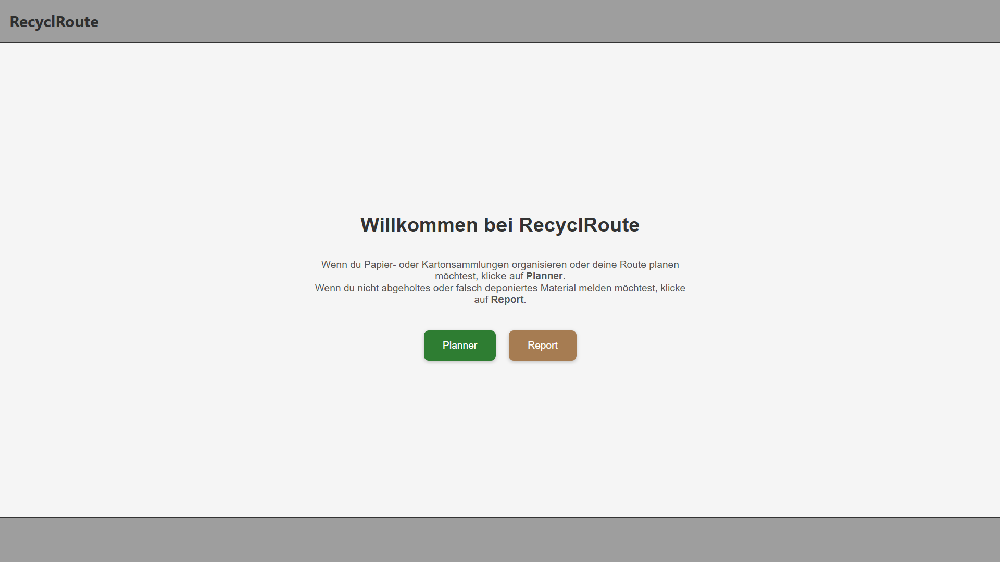

# Erklärung der Funktionen von RecyclRoute

In diesem Abschnitt werden die Funktionen und Interaktionen der RecyclRoute-Report, der StartPage und der Funktionen, die für Report und Planner gelten, beschrieben.

# Startpage

Auf der Startseite muss sich der Benutzer entscheiden, welche Funktion er nutzen möchte. Wenn man Papier- oder Kartonsammlungen organisieren oder Routen planen möchte, ist der Planner genau richtig. Wenn du hingegen abgeholtes oder falsch deponiertes Material melden möchtest, ist Report die geeignete Seite. Mit Klick auf den entsprechenden Button wird man auf die passende Seite geleitet. 

{: style="max-width: 75%; height: auto;" }

# Allgemeine Funktionen:

Folgende vier Funktionen sind sowohl im Report als auch im Planner enthalten:

## Suchfunktion Ortschaft
Damit kann ein spezifischer Ort in der Schweiz gesucht und angezeigt werden.

{: style="max-width: 75%; height: auto;" }

## Reportpunkte des Projektes anzeigen
Damit kann ein Projekt ausgewählt werden und alle dem Projekt zugeordneten Projektpunkte angezeigt werden.

{: style="max-width: 75%; height: auto;" }

## Aktueller Standort anzeigen
Mit diesem Button kann die GNSS Position des Gerätes abgegriffen werden. Bei erfolgreichem Abgreiffen der Position wird die Anzeige der Karte auf den Standort verschoben und zeigt die Position als Blauen Marker. 

{: style="max-width: 75%; height: auto;" }

## Karte nach Norden ausrichten
Mit dieser Funktion kann die Karte, wenn sie verdreht ist, wieder nach Norden ausgerichtet werden. 

{: style="max-width: 75%; height: auto;" }

# Funktionen Report:

Nach der Wahl der Report-Page auf der Startpage wird man auf die in Brauntönen gehaltene Report-Page weitergeleitet. Die Hauptfunktion der Report-Page ist das Absetzen der Reports.

{: style="max-width: 75%; height: auto;" }

## Report erstellen
Mit dem klicken auf den Button in der Fusszeile unten rechts, kann ein neuer Report erstellt werden. Dazu muss vorab aber schon ein Projekt erstellt worden sein, damit der Report einem Projekt zugewiesen werden kann. Voraussetzung für das Speichern eines Punktes sind:
- Auswahl Projekt
- Auswahl Bemerkung (Dropdown)
- Definiton Datum
- Upload Foto
- Definiton Position
Die Position kann durch klicken auf der Karte definiert werden und mit erneutem klicken geändert werden. Die Angabe aller Informationen ist zwingend für das Abspeichern eines Punktes. Nach dem Speichern eines Punktes schliesst das Fenster automatisch.

{: style="max-width: 75%; height: auto;" }

[↑ Zurück zum Beginn der Webseite](#top) 

  

    <a href="funktionen_planner.html">← Funktionen Planner</a>
  

  

    <a href="aufbauGDI.html">Aufbau GDI →</a>
  

