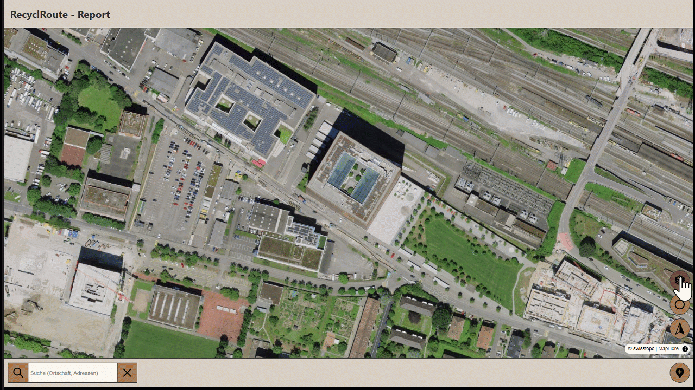

# Erklärung der Funktionen von RecyclRoute

In diesem Abschnitt werden die Funktionen und Interaktionen der RecyclRoute-Report beschrieben.

# Startpage

Auf der Startseite muss man sich bereits ein erstesmal entscheiden was man machen möchte. Wenn man Papier- oder Kartonsammlungen organisieren oder deine Route planen möchtest, muss man auf Planner klicken. Wenn du nicht abgeholtes oder falsch deponiertes Material melden möchtest, muss man auf Report klicken. Dann wird man dementsprechend auf die Seite mit den Entsprechenden Seiten geleitet. 

{: style="max-width: 75%; height: auto;" }

# Funktionen Report:

Nach dem Klicken auf Report wird man auf die Report Seite (brauntöne) weitergeleitet. Auf welcher die Standartfunktionen GNSS, Norden der Karte, Anzeigen der Punkte des Projektes funktionieren, sowie der Report erstellen.

{: style="max-width: 75%; height: auto;" }

## Report erstellen
Mit dem klicken auf den Button unten rechts, kann ein neuer Report erstellt werden. Dazu muss vorab aber schon ein Projekt erstellt worden sein, damit man auch den Report auch einem Projekt zuweisen kann. Mit auswählen des Projektes einer Bemerkung (nur Dropdown möglichkeiten) ein Datum eingegeben werden sowie ein Foto hochgeladen werden. Ebenso muss zwingend ein Punkt abgesetzt werden mit klicken auf die Karte. Dieser kann verschoben werden durch nochmaliges klicken. Mit Punkt speichern wird der Punkt in die Datenbank gespeichert und das Popup schliesst sich automatisch.

{: style="max-width: 75%; height: auto;" }

# Funktionen allgemein:

Folgende vier Funktionen sind sowohl im Report als auch im Planner enthalten:

## Ort Suche
Damit kann ein spezifischer Ort gesucht und abgerufen werden.

{: style="max-width: 75%; height: auto;" }

## Reportpunkte des Projektes anzeigen
Damit kann ein Projekt ausgewählt werden und alle dem Projekt zugeordneten Projektpunkte angezeigt werden.

{: style="max-width: 75%; height: auto;" }

## Aktueller Standort anzeigen
Mit der Funktion wird die GNSS Position des Gerätes abgegriffen, wenn eingeschalten & die Karte Zoom auf diesen Standort und zeigt die Position als Blauen Marker. 

{: style="max-width: 75%; height: auto;" }

## Karte nach Norden ausrichten
Mit dieser Funktion kann die Karte wieder nach Norden ausgerichtet werden wenn die Karte verdreht ist. 

{: style="max-width: 75%; height: auto;" }

[↑ Zurück zum Beginn der Webseite](#top) 

  

    <a href="konzept.html">← Konzept</a>
  

  

    <a href="aufbauGDI.html">Aufbau GDI →</a>
  

