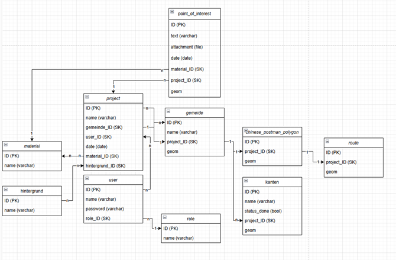
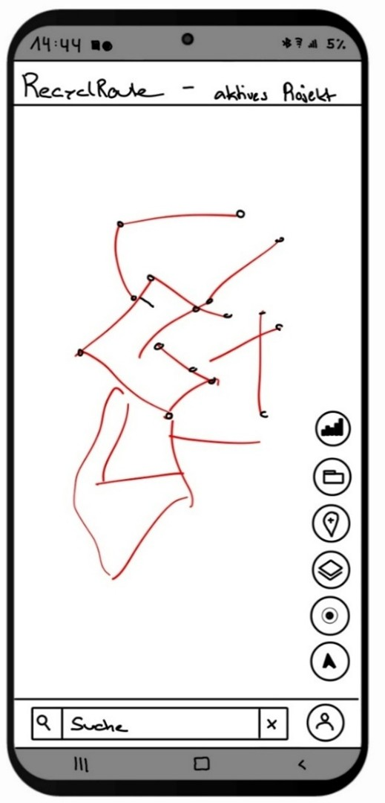
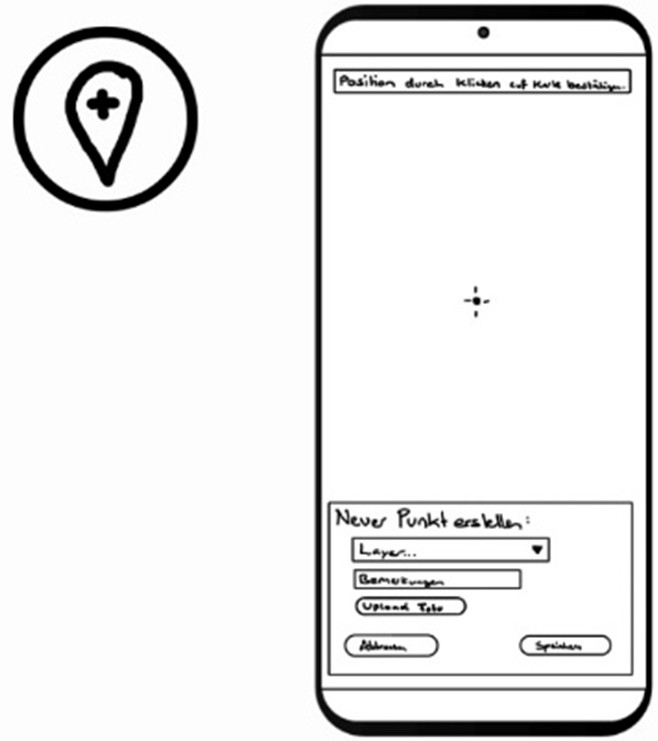
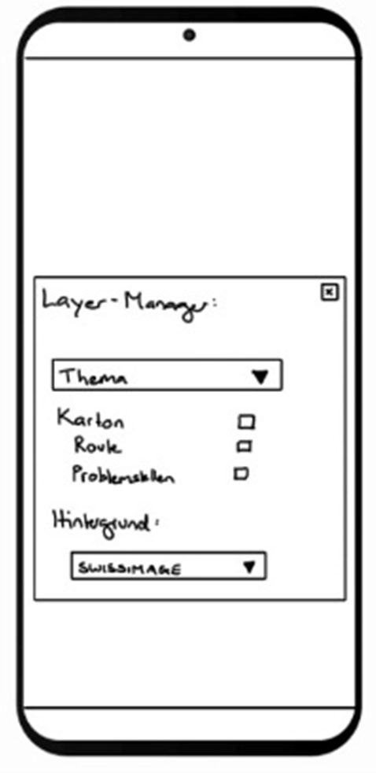
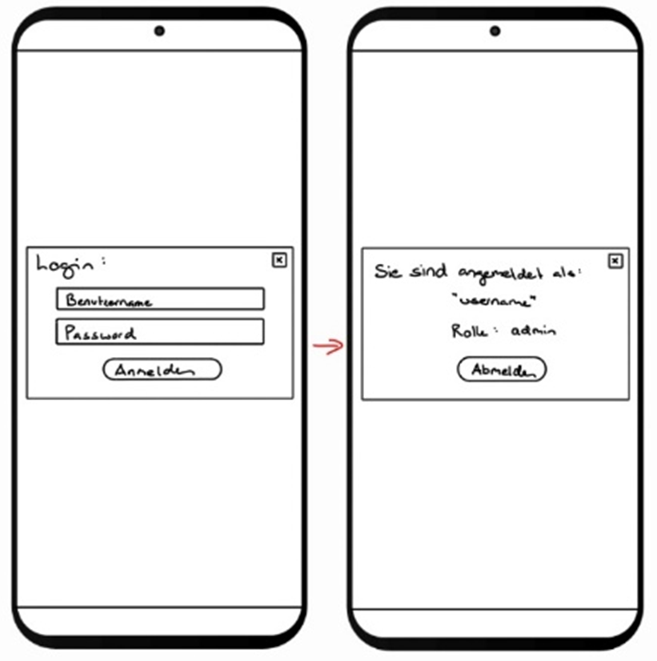
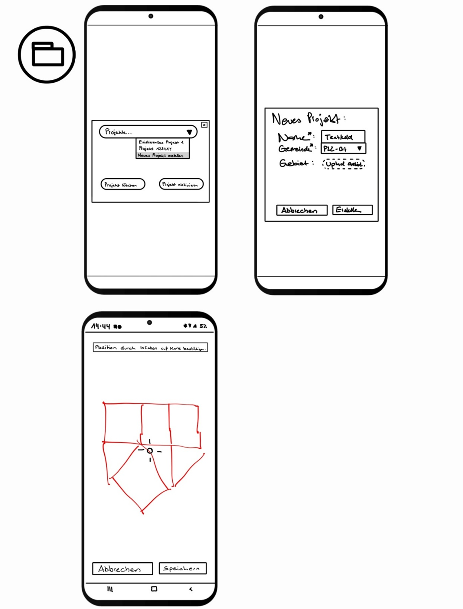
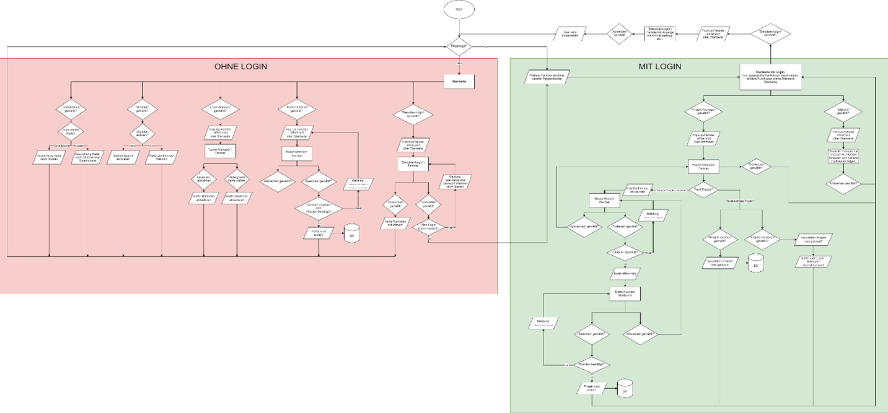

#  GIS-Konzept zur Papier- und Kartonsammlung, 4230 Geoinformatik & Raumanalyse vor Projektbeginn

In diesem Kapitel wird das ursprüngliche Konzept von RecyclRoute vorgestellt – also die erste Vision zur technischen und gestalterischen Umsetzung vor dem eigentlichen Aufbau der Dateninfrastruktur und des Frontends.

Das ganze wurde kann als PDF heruntergeladen werden [Konzept RecycleRoute (PDF)](assets/downloads/Konzept-RecyclingGIS.pdf) oder direkt untenstehend Eingesehen werden. 

## 1 Einleitung

Die Schweiz hat eine lange Tradition im Bereich Recycling und Umweltschutz. Ein wichtiger Bestandteil davon ist die Sammlung von Papier und Karton durch Vereine wie CEVI, Pfadi, JUBLA oder Turn-vereine. Diese Sammlungen tragen wesentlich zur Wiederverwertung von Rohstoffen bei und fördern das Umweltbewusstsein bereits in jungen Jahren.

Die Entwicklung eines Geoinformationssystems (GIS), das speziell auf die Bedürfnisse dieser Papier- und Kartonsammlungen zugeschnitten ist, bietet die Möglichkeit, diese Prozesse zu optimieren und effizienter zu gestalten. Ein solches GIS kann dabei helfen, Sammelrouten zu planen, die Abdeckung zu verbessern, falsch deponiertes Recyclinggut zu melden und die Kommunikation zwischen Samm-lern und der Bevölkerung zu erleichtern.

### 1.1 Fragestellung

•	Wie kann ein Routing-Algorithmus in einem GIS für Papier- und Kartonsammlungen eingesetzt werden, um effiziente Sammelrouten zu generieren und gleichzeitig die individuellen Bedürfnisse und Präferenzen der Sammler (z. B. CEVI, Pfadi, JUBLA, Sportvereine) zu be-rücksichtigen?

•	Welche Möglichkeiten gibt es, Statusupdates und eine Fortschrittsanzeige in ein GIS für Papier- und Kartonsammlungen zu integrieren, um sowohl den Sammlern als auch den Organisatoren einen Überblick über den aktuellen Stand der Sammlung zu geben und Engpässe frühzeitig zu erkennen?

•	Wie kann ein GIS die Dokumentation von Problemstellen erleichtern?

### 1.2 Ziel

Ziel ist die Entwicklung eines zentralen GIS, das wichtige Funktionen für die Papier- und Kartonsammlungen bereitstellt. Dazu gehört eine hochwertige Karte zur Orientierung und Navigation, die eine optimale Route berechnet, sodass alle Strassen fehlerfrei abgefahren werden können, ohne doppelte Wege zu verursachen.

Während der Sammlung soll die Position der Sammler automatisch aufgezeichnet werden, um erledigte Strassen zu erkennen oder diese allenfalls manuell als erledigt markieren zu können. Diese Informationen dienen der statistischen Auswertung und stehen auch anderen Nutzenden zur Verfügung. Zudem sollen Problemstellen dokumentiert und in einer Datenbank mit Zusatzinformationen und Fotos festgehalten werden.

## 2	Funktionalität und Aufbau

Die nachfolgenden Kapitel beschreiben wie die Architektur, die Datenbank, das Konzeptionelle Da-tenmodell, das Logische Datenmodell, das Physische Denkmodell sowie das Mockup/GUI Aufbau der geplanten Anwendung aussehen werden. Zudem ist ein Flussdiagramm der Funktionalitäten ersichtlich.

### 2.1 Architekturaufbau
Die zeigt den Architekturaufbau der geplanten Anwendung. Darin sind die Vier Bereiche (Frontend, Backend, API-Dienste und der Geoserver) mit entsprechenden Software-Icons ersichtlich.

{: style="max-width: 100%; height: auto;" }
Das Frontend der Anwendung funktioniert mit einem JavaScript basierten Aufbau mittels React. Zusätzlich werden andere Bibliotheken wie Leaflet und Open Layers verwendet um alle Funktionalitäten im Frontend zu gewährleistet. Das Frontend interagiert mittels Fast API mit dem Backend dabei kann auf den Geoserver oder auf eine PostGIS Datenbank zugegriffen werden. Die Daten auf dem Geoserver und in der PostGIS Datenbank werden mit einem Python Skript und den vorhandenen API-Diensten abgefragt und abgespeichert. Diese werden jeweils periodisch neu abgefragt, um die Aktualität zu garantieren.

### 2.2 Datenmodell und Datenbank

Der Aufbau der Datenbank wird über verschiedene Modell beschrieben. Das Logische und das phy-sische Datenmodell werden in den untenstehenden Abschnitten genauer erläutert.
**Logisches Datenmodell (Datenbankmodell)**
Die Abbildung zeigt das Logische Datenmodell für die geplante Anwendung. Darin ersichtlich sind verschiedene Tabellen mit jeweiligen Feldern und Datentypen.

{: style="max-width: 100%; height: auto;" }

**physisches Datenmodell (Datenbankschema)**
Die Realisierung des physischen Datenmodells ist für eine spätere Projektphase vorgesehen. In diesem Schritt erfolgt die konkrete Umsetzung der zuvor erarbeiteten konzeptionellen und logischen Datenstrukturen in einem spezifischen Datenbankmanagementsystem. Aufgrund der räumlichen Daten wird die Datenbank mittels PostgreSQL in Kombination mit der PostGIS-Erweiterung umgesetzt.
Als Datenbeschreibungssprache wird SQL benutzt.

### 2.3 Mockup und GUI-Aufbau

Auf der Startseite sind die Karte und die einzelnen Funktionsbuttons bereits von Beginn weg ersichtlich. Der obere Balken beinhaltet das Logo unserer Applikation sowie den Namen des aktiven Projekts. Dieser wird immer dargestellt, egal welche Funktion geöffnet wird. Der untere Balken enthält ein Suchfeld, bei dem nach Gemeinden und Adressen gesucht werden kann, welche dann zentriert in der Karte dargestellt werden. Nebenan befindet sich der Login Button. Der Untere Balken wird je nach geöffneter Funktion ausgegraut, damit der User diesen nicht benutzen kann.Von den Funktionsbuttons am Rand sind zu Beginn alle ausser der ProjektManager und der Statistik Button freigeschalten. Diese beiden Buttons werden erst nach dem Login freigeschalten.

{: style="max-width: 25%; height: auto;" }

Mit dem Button «Punkt erstellen», können neue Points of Interest (POI) hinzugefügt werden. Der User kann den Layer (Material) auswählen und eine Bemerkung sowie ein Foto dazu speichern. Das Zielkreuz befindet sich immer in der Mitte des Bildschirms und der User bewegt die Karte, so dass er einen Punkt absetzen kann. Mit «Klicken» bestätigt er die aktuelle Position. Mit Speichern, kann der Punkt anschliessend gespeichert werden. Wenn der User eingeloggt ist, wird er direkt in das aktive Projekt gespeichert. Wenn ein Gast einen Punkt speichert, muss er noch das Datum der Sammlung angeben (nicht in GUI dargestellt). So kann anschliessend mit dem Material, dem Standort und dem Datum, der Punkt dem richtigen Projekt zugeordnet werden.

{: style="max-width: 50%; height: auto;" }

Im Layer-Managers können die einzelnen Materialien (Layer) des aktiven Projekts ein- und ausgeschalten werden, sofern der User eingeloggt ist. Ansonsten kann nur die Hintergrundkarte angepasst werden.

{: style="max-width: 25%; height: auto;" }

Mit dem Login-Button öffnet sich ein Fenster, in dem man seinen Benutzer anmelden kann. Je nach Benutzer hat man unterschiedliche Berechtigungen.
Wenn man bereits angemeldet ist und auf den Button klickt wird einem angezeigt, welcher Benutzer eingeloggt ist und welche Rolle dieser hat. Mit dem Button Abmelden, kann man sich wieder ausloggen.

{: style="max-width: 50%; height: auto;" }

Mit dem Dropdown des Projekt-Manager, kann ein bestehendes Projekt ausgewählt werden oder ein neues Projekt erstellt werden. Wenn ein neues Projekt erstellt wird öffnet sich ein neues Fenster bei dem alle notwendigen Attribute eingegeben werden können. Wenn diese eingegeben und mit Erstellen bestätigt werden öffnet sich die Karte, wo anschliessend mit dem gleichen Prinzip wie beim Erfassen der POI ein Startpunkt für das Routing ausgewählt werden kann.

{: style="max-width: 50%; height: auto;" }

### 2.4 Flussdiagramm
Im Flussdiagramm ist der gesamte Ablauf der einzelnen Funktionen ersichtlich. Dieser ist in zwei Bereiche eingeteilt, in einen Bereich, welcher kein Login benötigt (rot) und in den Bereich der ein Login benötigt (grün). Das Flussdiagramm beschreibt die in Abschnitt 2.3 erwähnten Funktionen und GUI’s. Die Funktionen ohne Login sind auch nutzbar und dargestellt, wenn das Login getätigt wurde. Damit das Flussdiagramm jedoch nicht zu komplex und überfüllt wird, werden diese Funktionen im Bereich mit Login nicht erneut aufgeführt.

{: style="max-width: 100%; height: auto;" }

## 3 User Persona
Die User Personas sollen fiktive, aber realitätsnahe Nutzer abbilden, welche die Applikation nutzen werden. Es sollen dazu verschiedene Nutzertypen und Interaktionen abgebildet werden. 
### 3.1 Person 1
**Name, Alter:** Elias, 14 Jahre
**Beruf:** Schüler, Mitglied in der Jungschar

**Interessen:**
Elias engagiert sich aktiv in der Jungschar und hilft gerne bei sozialen Aktionen wie der Papiersamm-lung mit. Er schätzt es, Verantwortung zu übernehmen und gemeinsam mit seinem Team einen Beitrag für die Umwelt zu leisten.

**Beschrieb der Nutzung:**
Elias nutzt die Applikation während der Papiersammlung, um erledigte Strassen als „abgeschlossen“ zu markieren. Falls er falsch entsorgtes Material oder Problemstellen wie überfüllte Container ent-deckt, dokumentiert er diese in der App, damit sie später gemeldet und behoben werden können.

**Inkorrekte Interaktionen:**

Hat Schwierigkeiten, den Bereich zum Dokumentieren von Problemstellen zu finden.
Versteht nicht sofort, ob eine Strasse bereits als erledigt markiert wurde oder nicht.

### 3.2 Person 2
**Name, Alter:** Sarah, 24 Jahre
**Beruf:** Studentin, Organisatorin der Papiersammlung

**Interessen:**
Sarah ist sehr organisiert und liebt es, Abläufe effizient zu gestalten. Sie studiert Umweltwissenschaften und interessiert sich für nachhaltige Projekte. Die Organisation der Papiersammlung ist ihr wichtig, weil sie damit einen positiven Beitrag zur Recyclingkultur leisten kann.

**Beschrieb der Nutzung:****
Sarah verwendet die App, um die Sammelrouten im Voraus zu planen und den Überblick über den Fortschritt der Sammlung zu behalten. Sie prüft regelmässig, welche Strassen bereits erledigt sind und wo noch Papier abgeholt werden muss. Ausserdem nutzt sie die App, um Probleme oder Verzögerungen schnell zu erkennen und gegebenenfalls Helfer umzuverteilen.

**Inkorrekte Interaktionen:**

Kann nicht auf einen Blick erkennen, welche Teams in welchen Strassen aktiv sind.
Möchte eine Route anpassen, findet aber die Bearbeitungsfunktion nicht.
### 3.3 Person 3

**Name, Alter:** Markus, 46 Jahre
**Beruf:** Sozialarbeiter

**Interessen:**
Markus legt grossen Wert auf eine saubere Umgebung und beteiligt sich aktiv daran, sein Quartier ordentlich zu halten. Er nutzt digitale Anwendungen, um lokale Anliegen zu melden, ist aber kein täg-licher Techniknutzer.

**Beschrieb der Nutzung:**
Markus nutzt die App gelegentlich, um Problemstellen wie nicht abgeholtes Altpapier oder unsach-gemässe Entsorgungen zu melden. Auch kann er beim Verein, der das Papier sammelt, melden wenn er mal grössere Mengen bei sich abzuholen hat. 

**Inkorrekte Interaktionen:**

Ist unsicher, wie er eine Meldung korrekt absendet.
Weiss nicht, ob seine Meldung erfolgreich übermittelt wurde.

## 4  Datensätze (Metadaten und Dokumentationen z.B. von API)
Benötigte Daten werden untenstehend aufgelistet. Die Liste ist nach aktuellem Planungsstand und kann noch Veränderungen aufweisen.
### 4.1 SwissBoundary
 Gemeindegrenzen: Für die Gemeindeflächen sowie Postleitzahlen werden die SwissBoundaries als .gpkg auf der Datendank gespeichert und weiterverwendet. Eine Liveinteraktion mittel API ist nicht nötig, da diese Grenzen relativ statisch sind.
https://www.swisstopo.admin.ch/de/landschaftsmodell-swissboundaries3d

### 4.2 Github Valhalla Chinesepostman Problem

Routing Problem: Das Problem des Routings soll mittels der Lösung der Firma camptocamp welches den Code unter https://github.com/valhalla/valhalla/pull/3428 abgelegt hat verwendet werden. Die Firma hat ein Routing auf Grundlage der 3 Algorithmen Floyd-Warshall, Hungarian Method und Hier-holzer Methode erstellt, welches das Problem für die Firma Armasuisse versuchte anzugehen. Ge-mäss Dokumentation sollte auch eine Integration der Swisstopodaten anstatt OSM möglich sein. 
### 4.3 OpenStreetMap API
OpenStreetMap: Von den OpenstreetMap Daten beziehen wir die Strassenachsen für die Berech-nung der Routen. Die OSM-Daten stehen zur Freien Nutzung und ohne Einschränkungen zur Verfü-gung. https://wiki.openstreetmap.org/wiki/API#Terms_of_use

### 4.4	Amtliches Strassenverzeichnis API (Swisstopo) [optional]
Strassenverzeichnis: Anstatt OSM Daten könnte man zu einem späteren Zeitpunkt versuchen die Strassenachsen aus dem amtlichen Strassenverzeichnis zu exportieren. Und via API einbinden:
https://data.geo.admin.ch/browser/index.html#/collections/ch.swisstopo.amtliches-strassenverzeichnis?.language=en

### 4.5 Meteo API [optional]

Meteo: Die Wetter Daten werden über https://www.meteomatics.com/de/free-wetter-api/ bezogen wobei 500 Abfragen am Tag kostenfrei sind. Diese Daten werden für eine Optionale Analyse benötigt um bei schlecht Wetter das Gewicht der voraussichtlichen Papiersammelmenge und somit die Route anzupassen.

## 5	Organisation

In den folgenden Abschnitten wird die Organisation des Projektes beschreiben. Das Projekt
wird agile geführt.
### 5.1	Dateiablage

Für die Dauer des Projekts werden alle Daten sowie die Kommunikation in einem Arbeitsraum
in MS Teams geführt. Dieser wurde extra für diesen Zweck erstellt.

**GitHub Repository**
Hier wird der Plattformcode abgelegt und verwaltet.
https://github.com/RecyclRoute/RecyclRoute

**Kommunikation**
Die Kommunikation erfolgt über MS Teams und Whatsapp, wobei im Whatsapp vorallem schnelle Infos und Updates informiert werden und in MS Teams überlangfristige. Ebenso erfolgten falls benö-tigt digitale Sitzungen über MS Teams.

**To Do**
Die ToDo’s werden in einem an Scrum angelehnten Board in MSTeams geführt, damit eine klare übersicht vorhanden ist.
### 5.2	Zeitplan
Es wurde ein Zeitplan erstellt, welcher nach und nach ergänzt wird. Dieser dient als Ergänzung zum Task Board in MS Teams.
### 5.3	Rapport
Der Arbeitsaufwand wird laufend erfasst damit am ende vom Projekt eine Analyse zwischen dem geplanten und effektiven Zeitaufwand gemacht werden kann. Dafür wird in einer Excel Tabelle je-weils der Aufwand erfasst und es wird automatisch eine Statistik mit den Aufwandsummen pro Per-son oder pro Tätigkeit erstellt.

[↑ Zurück zum Beginn der Webseite](#top) 

  

    <a href="aufbauGDI.html">← Aufbau GDI</a>
  

  

    <a href="Erweiterungsmöglichkeiten.html">Erweiterungsmöglichkeiten →</a>
  

