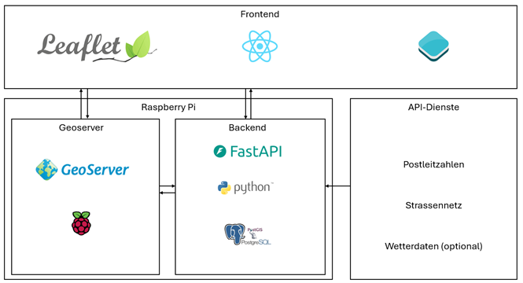

# Ursprüngliches Konzept

In diesem Kapitel wird das ursprüngliche Konzept von **RecyclRoute** vorgestellt – also die erste Vision zur technischen und gestalterischen Umsetzung vor dem eigentlichen Aufbau der Dateninfrastruktur und des Frontends.

---

### Erste Architektur der Geodateninfrastruktur (GDI)

Die nachfolgende Skizze zeigt den frühen Entwurf der Architektur. Während der Umsetzung mussten einige Elemente angepasst und vereinfacht werden. Die finale Systemstruktur findest du im Kapitel [Aufbau GDI](aufbauGDI.html#gdi-final).

---

### Mockup

Zur Planung wurde vor der technischen Entwicklung ein grafisches Konzept (Mockup) erstellt. Ziel war es, ein **intuitives, funktionales User Interface** für Sammler:innen, Organisator:innen und gelegentliche Nutzer:innen zu entwerfen. Die wichtigsten Bereiche wie Karte, Funktionsleiste und Login wurden dabei vorab definiert.

  

#### Abweichungen zur Endversion:
- Die ursprünglich geplante Wetteranzeige wurde nicht umgesetzt.
- Die Route wird nicht live berechnet, sondern basiert auf vorbereiteten Segmenten welche zur Route gerechnet werden.
- Der Login-Bereich ist einfacher gehalten als geplant.
- Einige Icons und Buttons wurden visuell angepasst, um die Barrierefreiheit zu verbessern.
- Das ganze Design wurde gesplittet in Planer & Report

---

### Visualisierungsideen

Als Inspiration dienten bestehende Kartendienste, mobile Apps zur Müllmeldung und statische Visualisierungen von Routen (z. B. bei OpenStreetMap). Im Fokus stand stets eine **klare Darstellung der zu sammelnden Routen, sowie eine Benutzerfreundliche Bedienung**.

Die Hauptfunktionen sollten mit wenigen Klicks erreichbar sein. Es wurden kontrastreiche Farben, klar erkennbare Symbole und responsive Bedienelemente geplant.

---

[↑](#top)

  

    <a href="aufbauGDI.html">← Aufbau GDI</a>
  

  

    <a href="ausblick.html">Erweiterungsmöglichkeiten →</a>
  

